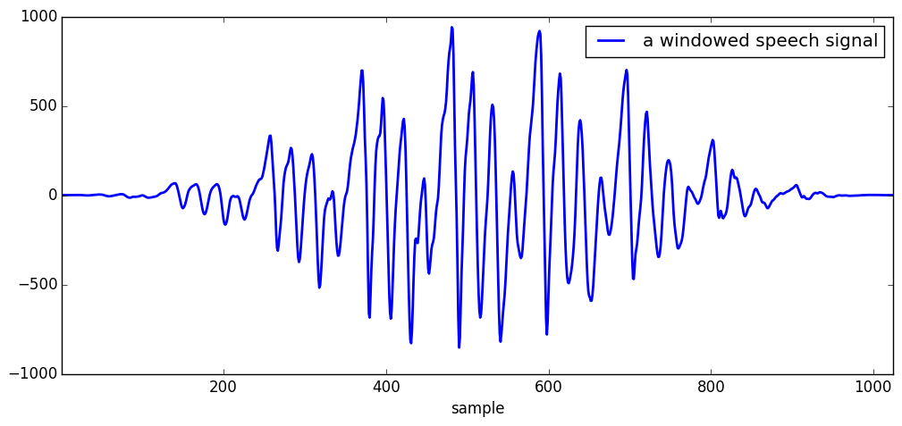
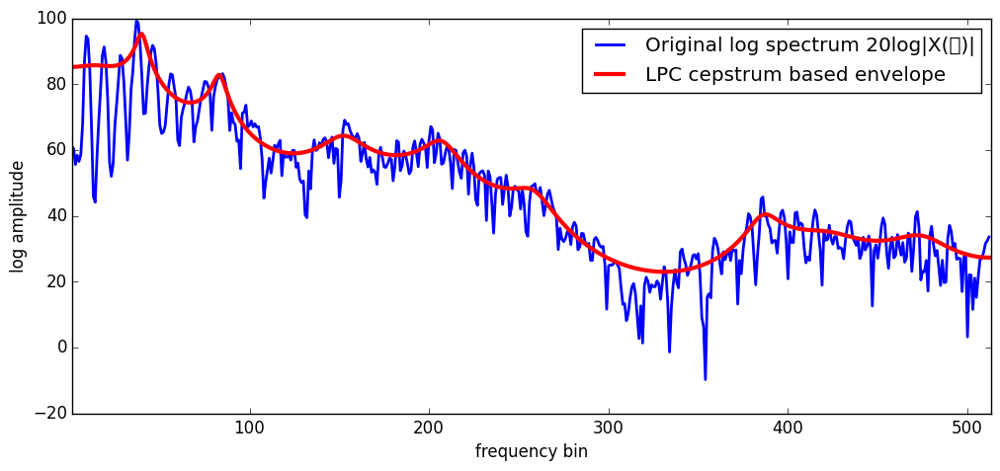
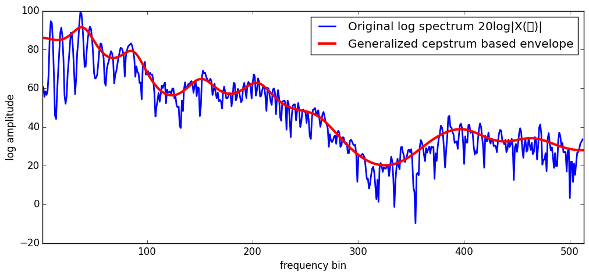

# MelGeneralizedCepstrums

[](https://travis-ci.org/r9y9/MelGeneralizedCepstrums.jl)
[](https://ci.appveyor.com/project/r9y9/melgeneralizedcepstrums-jl/branch/master)
[](https://coveralls.io/r/r9y9/MelGeneralizedCepstrums.jl?branch=master)
[](LICENSE.md)

MelGeneralizedCepstrums.jl provides a mel generalized cepstrum anlysis for spectral envelope estimation that includes:

- linear predicition analysis (LPC)
- generalized cepstrum analysis
- mel-cepstrum analysis
- mel-generalized cepstrum analysis

This package also provides mel-generalized cepstrum conversions, e.g mel-generalized cepstrum to mel-cepstrum, mel-cepstrum to (linear frequency) cepstrum, mel-cesptrum to filter coefficients of waveform synthesis filter (known as mel-log spectrum approximation digital filter), and vise versa.

Note that this package is built on top of [SPTK.jl](https://github.com/r9y9/SPTK.jl). A part of the core is re-writen in Julia language from [Speech Signal Processing Toolkit (SPTK)](http://sp-tk.sourceforge.net/).


## How spectral envelope estimation works

We show how the spectral envelope estimation works. Suppose that we have a *windowed* speech signal `x` and we want to extact spectral enelope from that.



### Linear frequency Cepstrum

```julia
c = estimate(LinearCepstrum(20), x)

logH = real(mgc2sp(c, 1024))
logspec = 20.0/log(10)*logH # 20log10(|H(ω)|)  = 20/log(10)*log(|H(ω)|)
```


### Mel-Cepstrum

```julia
mc = estimate(MelCepstrum(20, 0.41), x)

logH = real(mgc2sp(mc, 1024))
logspec = 20.0/log(10)*logH
```


### LPC-Cepstrum

```julia
lpc = estimate(AllPoleCepstrum(20), x)

logH = real(mgc2sp(mgc, 1024))
logspec = 20.0/log(10)*logH
```



### Warped LPC-Cepstrum

```julia
mgc = estimate(MelGeneralizedCepstrum(20, 0.41, -1.0), x)

logH = real(mgc2sp(mgc, 1024))
logspec = 20.0/log(10)*logH
```


### Generalized Cepstrum

```julia
mgc = estimate(GeneralizedCepstrum(20, -0.35), x)

logH = real(mgc2sp(mgc, 1024))
logspec = 20.0/log(10)*logH
```



### Mel-Generalized Cepstrum

```julia
mgc = estimate(MelGeneralizedCepstrum(20, 0.41, -0.35), x)

logH = real(mgc2sp(mgc, 1024))
logspec = 20.0/log(10)*logH
```


For the complete code of visualizations shown above, please check [the ijulia notebook](http://nbviewer.ipython.org/github/r9y9/MelGeneralizedCepstrums.jl/blob/master/examples/MelGeneralizedCepstrumsBasedEnvelope.ipynb).
